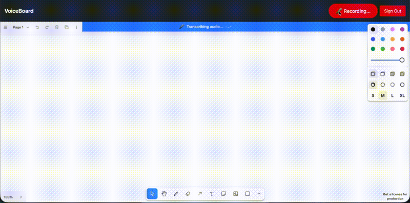

# VoiceBoard - Speech-to-Whiteboard Application

Real-time collaborative whiteboard controlled by voice commands.

**🚀 Live Demo:** [voiceboard.halvorteigen.no](https://voiceboard.halvorteigen.no)



See the full screen recording [here](docs/screen-recording-db-server-client-diagram.mov)

## Current Status: Stage 3.5 Complete ✅

### Stage 1: The Skeleton ✅
- ✅ Monorepo structure (client/server)
- ✅ Supabase Auth (Email/Password, Magic Link, Phone, Google)
- ✅ Ktor WebSocket server with JWT verification
- ✅ Deepgram live streaming integration
- ✅ Basic tldraw canvas
- ✅ Push-to-Talk button
- ✅ Live transcript toast

### Stage 2: Semantic Engine ✅
- ✅ Groq integration (Llama 3.3 70B)
- ✅ Sketch Protocol system prompt
- ✅ Graph state management
- ✅ Real-time command streaming

### Stage 3: Visualizer ✅
- ✅ ELK.js graph layout
- ✅ Custom diagram nodes with icons
- ✅ Automatic arrow routing
- ✅ Bidirectional edge support
- ✅ Voice-controlled diagram manipulation

### Stage 3.5: Advanced Shape Types ✅
- ✅ **Frames/Grouping:** Colored frames with parent-child relationships & hierarchical layout
- ✅ **Semantic Colors:** Node types auto-colored (database=green, server=blue, etc.)
- ✅ **Text Boxes:** Headers, body text, captions with rich formatting (bold, italic, lists)
- ✅ **Sticky Notes:** Annotation support with voice commands
- ✅ **Smart Positioning:** Relative placement (above/below/left/right of nodes or entire drawing)
- ✅ **Manual Edit Persistence:** Position/size changes preserved across voice commands
- ✅ **Efficient Rendering:** Updates existing shapes instead of full re-render

## Prerequisites

- Node.js 18+
- Java 21
- Gradle 8.12 (via Homebrew)
- Supabase account
- Deepgram API account
- Groq API account

## Quick Start (Local Development)

```bash
make install        # Install dependencies
make setup-local    # Start local Supabase + create .env files
# Add Deepgram API key to server/.env
make dev-server     # Terminal 1
make dev-client     # Terminal 2
```

Go to http://localhost:5173 and sign up!

See [LOCAL_DEVELOPMENT.md](docs/LOCAL_DEVELOPMENT.md) for detailed guide.

---

## Setup

### 1. Supabase Setup

1. Create project at https://supabase.com
2. Enable authentication providers:
   - Email/Password
   - Magic Link
   - Phone (optional)
   - Google OAuth (optional)
3. Get credentials (Settings → API):
   - Project URL (e.g., `https://xxxxx.supabase.co`)
   - Publishable key (public API key for client-side use)

### 2. Deepgram Setup

1. Create account at https://deepgram.com
2. Get API key from console

### 3. Groq Setup

1. Create account at https://groq.com
2. Get API key from console

### 4. Environment Variables

**Client** (`client/.env`):
```env
VITE_SUPABASE_URL=https://your-project.supabase.co
VITE_SUPABASE_PUBLISHABLE_KEY=your-publishable-key
VITE_WS_URL=ws://localhost:8080/ws
```

**Server** (`server/.env`):
```env
SUPABASE_URL=https://your-project.supabase.co
DEEPGRAM_API_KEY=your-deepgram-api-key
GROQ_API_KEY=your-groq-api-key
PORT=8080
```

### 5. Install Dependencies

**Using Makefile (recommended):**
```bash
make install        # Installs both client and server deps
make setup-env      # Creates .env files from examples
```

**Or manually:**
```bash
cd client && npm install
cd server && ./gradlew build
```

## Running the Application

### Quick Start (using Makefile)
```bash
# Terminal 1 - Backend
make dev-server

# Terminal 2 - Frontend
make dev-client
```

### Or Manually

**Start Backend:**
```bash
cd server
source .env  # or export variables manually
./gradlew run
```

**Start Frontend:**
```bash
cd client
npm run dev
```

Open http://localhost:5173

### Other Useful Commands
```bash
make help          # Show all available commands
make build         # Build both client and server
make clean         # Clean build artifacts
make check-env     # Verify environment setup
```

## Usage

1. **Login** - Choose auth method and sign in
2. **Connect** - WebSocket connects automatically with JWT
3. **Draw** - Hold Push-to-Talk and speak diagram commands:
   - **Nodes:** "Create a web server box" / "Add a database called PostgreSQL"
   - **Arrows:** "Draw arrow from web server to database" / "Make that bidirectional"
   - **Frames:** "Group the server and database in a backend frame"
   - **Text:** "Add a title that says 'System Architecture'"
   - **Notes:** "Add a sticky note saying 'needs optimization'"
   - **Positioning:** "Add a note above the database" / "Put text below the entire diagram"
   - **Deletion:** "Remove the database box"
4. **View** - Watch diagrams appear automatically with auto-layout & semantic colors

## Tech Stack

### Frontend
- React + Vite + TypeScript
- tldraw (whiteboard with custom shapes)
- ELK.js (graph auto-layout)
- Supabase JS (auth)
- Tailwind CSS

### Backend
- Kotlin + Ktor
- Netty (server)
- WebSockets
- JWT verification
- Deepgram (STT)
- Groq (Llama 3.3 70B for command interpretation)

## Architecture

```
Voice Input → Deepgram → Transcript → Groq (Llama 3) → Sketch Commands
                                                              ↓
Browser ← WebSocket ← Ktor WebSocket Server ← JSON Actions ←┘
   ↓
ELK.js Layout → tldraw Rendering
```

## Next Stages

- **Stage 4:** Architect Review (Claude 3.5 Sonnet for diagram analysis)
- **Stage 5:** Persistence (Save/load diagrams to Supabase)
- **Stage 6:** Multi-Language Support (Deepgram language config for STT)

## Project Structure

```
.
├── client/                  # React frontend
│   ├── src/
│   │   ├── components/      # PushToTalk, TranscriptToast
│   │   ├── contexts/        # AuthContext
│   │   ├── hooks/           # useWebSocket
│   │   ├── lib/             # Supabase client
│   │   └── pages/           # Login, Whiteboard
│   └── package.json
│
└── server/                  # Kotlin backend
    ├── src/main/kotlin/com/voiceboard/
    │   ├── features/
    │   │   ├── auth/        # JwtVerifier
    │   │   └── transcription/ # DeepgramClient
    │   └── Application.kt
    └── build.gradle.kts
```

## Troubleshooting

**WebSocket won't connect:**
- Check JWT token is being sent in Authorization header
- Verify SUPABASE_URL is correct (should match your frontend URL)
- Backend uses JWKS to verify tokens (fetches public keys from Supabase)
- Check backend logs for JWT verification errors

**No transcript appearing:**
- Verify DEEPGRAM_API_KEY is valid
- Check browser microphone permissions
- Check backend logs for Deepgram errors

**Build errors:**
- Ensure Java 21 is installed: `java -version`
- Clear Gradle cache: `./gradlew clean build`
- Clear npm cache: `rm -rf node_modules && npm install`
